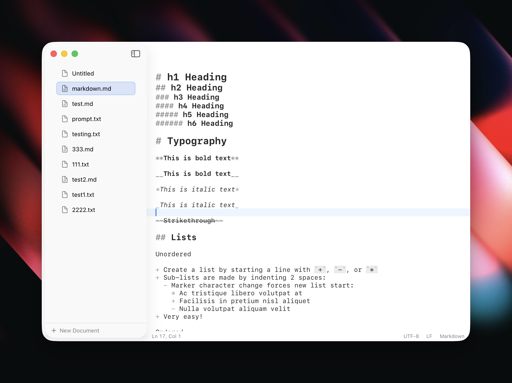

# NoteMac

A simple, fast text editor for macOS built with SwiftUI with basic Markdown support. Purely a vibe coded experiment for testing purposes — not a single line of code was written or read in the process. Built in a few hours.



## Releases

Download a ready-to-use version in the [release section](https://github.com/robinebers/notemac-app/releases).

## Features

- Native macOS app with SwiftUI
- Tabbed document interface
- Bear-style live Markdown rendering (syntax visible but dimmed)
- Find and replace
- Session persistence (reopens your documents on launch)
- Customizable font size, word wrap, and line numbers

## Requirements

- macOS 15.0+
- Xcode 16+ / Swift 6.0+

## Development

```bash
# Run the app
swift run

# Run tests
swift test
```

## Building for Distribution

The app uses Apple's notarization for distribution outside the App Store.

### Prerequisites

1. **Apple Developer ID certificate** - Get from [Apple Developer Portal](https://developer.apple.com/account/resources/certificates)
2. **notarytool credentials** - Store in Keychain:
   ```bash
   xcrun notarytool store-credentials "notarytool-profile" \
       --apple-id "your@email.com" \
       --team-id "YOUR_TEAM_ID"
   ```

### Setup

Copy `.env.example` to `.env` and fill in your values:

```bash
cp .env.example .env
```

Required variables:
| Variable | Description |
|----------|-------------|
| `SIGNING_IDENTITY` | Your Developer ID certificate name (from `security find-identity -v -p codesigning`) |
| `KEYCHAIN_PROFILE` | The profile name used with `notarytool store-credentials` |

### Build & Notarize

```bash
# Full build, sign, and notarize
./scripts/build-and-notarize.sh

# Build and sign only (for local testing)
./scripts/build-and-notarize.sh --skip-notarize
```

Output:
- `build/NoteMac.app` - Signed and notarized app bundle
- `build/NoteMac.zip` - Ready for distribution

## Project Structure

```
NoteMac/
├── Sources/NoteMac/
│   ├── Models/          # AppState, Document
│   ├── Views/           # SwiftUI views
│   ├── Services/        # FileService, SessionStore
│   └── NoteMacApp.swift # App entry point
├── scripts/
│   └── build-and-notarize.sh
├── Info.plist           # App bundle metadata
├── NoteMac.entitlements # Hardened runtime permissions
└── Package.swift
```

## License

MIT
